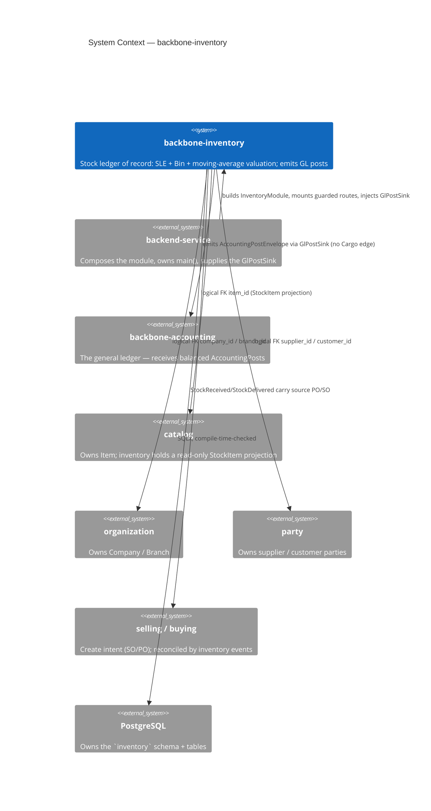
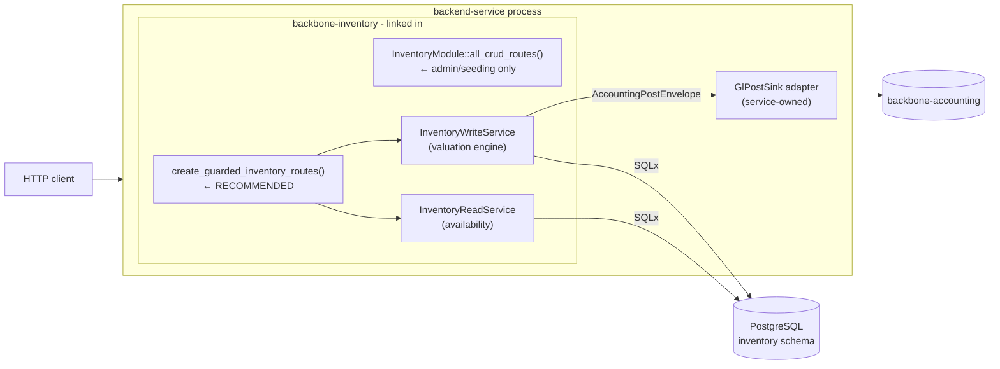
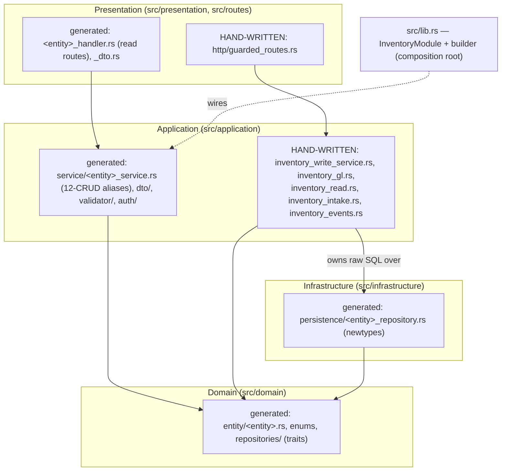

<!-- Reader: Maintainer · Mode: Explanation -->
# Architecture

`backbone-inventory` is a **library crate** that owns the supply-chain stock ledger as four DDD
layers. It does not run on its own — a `backend-service` composes it, hands it a database pool and a
`GlPostSink`, and mounts its router. Roughly two-thirds of `src/` is **generated** from the schema
YAML; the valuable third — the valuation engine, the GL seam, the guarded surface — is
**hand-authored** inside regen-safe files. This page shows the system top-down (C4), then traces one
Purchase Receipt from HTTP to a balanced journal.

## 1. Context

Who uses inventory, and what it references. Inventory owns **one** master (`Warehouse`); everything
else is a logical FK to a sibling module — **zero horizontal Cargo edges**
([ADR-001](../adr/ADR-001-inventory-boundary-and-valuation.md)).



*What to notice: inventory is a **dependency**, never an entrypoint. It posts to accounting through a
**trait**, not a Cargo dependency — the arrow to `backbone-accounting` is a runtime envelope the
service wires up. Identity, catalog, company, and party all come from siblings **by UUID reference**,
never a copied-in table.*

## 2. Containers — the two route surfaces

The module compiles into the service binary; there is no separate inventory process. It exposes
**two** compositions, and choosing the right one is a security decision.



*What to notice:* `all_crud_routes()` mounts **unvalidated** generic CRUD on every entity — a
well-formed request could write a raw SLE or soft-delete a warehouse out from under its stock. It
exists for trusted admin/seeding only, and the plain `routes()` alias is `#[deprecated]` for exactly
this reason. **Production mounts `create_guarded_inventory_routes()`**: read models + validated
creates, with direct SLE/Bin writes and generic deletes *not exposed*. Submitting a movement needs a
`GlPostSink`, so it is service/job-driven, not a bare public route
([golden cases IIP-1…4](../business-flows/golden-cases.md)).

## 3. Components — the generated cake vs. the hand-written engine

Dependencies point **inward only**. The split between generated and hand-written is the thing to
internalize.



| Layer | Directory | Generated | Hand-written (regen-safe) |
|-------|-----------|-----------|---------------------------|
| **Domain** | `src/domain/` | 12 entities (`Warehouse`, `StockItem`, `StockLedgerEntry`, `Bin`, the 4 documents + their line items), the enums (`VoucherType`, `DocStatus`, `GlPostingState`, `WarehouseType`, `ValuationMethod`, `StockEntryType`), repository **traits** | — |
| **Application** | `src/application/` | `<Entity>Service` type aliases (12-CRUD each), DTOs, validators, per-entity auth guards | **`InventoryWriteService`** (valuation + SLE + Bin + GL emit), **`inventory_gl.rs`** (`GlPostSink`, `AccountingPostEnvelope`), **`InventoryReadService`** (availability), **`DeliveryIntake`** (selling seam), **`inventory_events.rs`** |
| **Infrastructure** | `src/infrastructure/` | `<Entity>Repository` newtypes over `GenericCrudRepository` | — (the write service uses raw SQLx directly for the movement transaction) |
| **Presentation** | `src/presentation/`, `src/routes/` | per-entity read handlers + DTOs | **`http/guarded_routes.rs`** (validated creates, availability, delivery-intake) |
| **Composition** | `src/lib.rs` | `InventoryModule` + `InventoryModuleBuilder`, re-exports | the `// <<< CUSTOM` builder hooks |

> **Composition root note.** The live composition root is **`InventoryModule` in
> [`src/lib.rs`](../../src/lib.rs)** — it wires the twelve services from the pool. The file
> [`src/module.rs`](../../src/module.rs) still contains the skeleton's `Module` (a single `Example`
> service) and is **not** part of the crate's module tree; treat it as vestigial, not authoritative.

## 4. Data & control flow — `submit_purchase_receipt` end to end

The interesting path is not a CRUD create — it is *submitting a movement*, which writes the ledger,
updates the balance, and posts to the GL. Trace a Purchase Receipt.

```mermaid
sequenceDiagram
    actor Caller as Service / job
    participant W as InventoryWriteService
    participant DB as PostgreSQL (inventory schema)
    participant Sink as GlPostSink (service-owned)
    participant GL as backbone-accounting

    Caller->>W: submit_purchase_receipt(receipt_id, &sink)
    W->>DB: load header (must be status=draft) + lines
    Note over W,DB: --- one transaction: physical movement ---
    loop each line
        W->>DB: SELECT bin FOR UPDATE (serializes; no oversell)
        Note over W: new_qty = qty + q; new_value = value + money(q·rate)<br/>new_rate = new_value / new_qty  (blend)
        W->>DB: UPDATE bin(qty, rate, value)
        W->>DB: INSERT StockLedgerEntry (immutable, +qty, value_diff)
    end
    W->>DB: UPDATE receipt SET status = submitted
    W->>DB: COMMIT
    Note over W,GL: --- after commit: GL post (eventually consistent) ---
    W->>Sink: post(AccountingPostEnvelope[Dr Inventory · Cr GR/IR])
    alt GL accepts
        Sink->>GL: PostingService (real ledger)
        GL-->>W: ack {journal_id, post_id}
        W->>DB: UPDATE receipt SET posting_state = posted, journal_id, posted_at
    else GL rejects
        GL-->>W: rejected {code}
        W->>DB: UPDATE receipt SET posting_state = failed
        Note over W: SLE + Bin STAND. Retry via repost_purchase_receipt().
    end
```

*What to notice, in order of importance:*

1. **The physical movement commits first, in one transaction.** SLE + Bin move together, atomically.
   The GL post happens *after* commit — so a GL outage can never lose or half-apply a stock movement.
2. **`SELECT … FOR UPDATE` on the Bin serializes concurrent movements.** Two deliveries racing for the
   last units can't both win; exactly one succeeds, the other gets `insufficient_stock` (golden case
   IVC-9). No oversell.
3. **The envelope is balanced by construction** (`debit == credit`, asserted before emit). Accounting
   dedupes on `(company, source_type="inventory", source_id=receipt_id, posting_type)`, so a re-emit
   is idempotent — reposting a crash-window voucher returns the *same* journal, never a second.
4. **A `failed` post is not terminal.** `repost_purchase_receipt(id, &sink)` rebuilds the identical
   envelope from the stored header and re-drives it; an already-`posted` voucher short-circuits.

The **Delivery Note** path is the mirror image: `SELECT bin FOR UPDATE`, reject if `bin.qty < qty`,
consume the current average as COGS (**the rate does not change**), flush the residual to exactly 0 on
the final outflow, write a `-qty` SLE, then post `Dr COGS · Cr Inventory`. A **Stock Entry transfer**
writes a *paired* out/in SLE at the source rate — value-neutral, `posting_state = not_applicable`, no
GL post. A **Stock Reconciliation** sets each bin to the counted figure and posts the signed
difference.

## Where persistence & valuation semantics come from

- **Own schema per module** → migrations `CREATE SCHEMA inventory` and qualify every table as
  `inventory.<table>`, so inventory never collides with another module on a table name.
- **Soft delete + audit** (`config.soft_delete`/`audit` in [`index.model.yaml`](../../schema/models/index.model.yaml))
  → a `metadata` JSONB column (`created_at`, `updated_at`, `deleted_at`, `*_by`); timestamps are
  trigger-managed, the `*_by` actors are logical FKs to `sapiens.User.id`. Every read path filters
  `metadata->>'deleted_at' IS NULL`.
- **Money precision is a domain invariant, not a formatting choice.** `stock_value` and GL amounts are
  `decimal(18,2)` rounded half-up; `valuation_rate` is `decimal(18,6)`. The write service's `money()`
  and `rate6()` helpers apply these consistently so the subledger ties to the GL to the cent.
- **The SLE unique index `(voucher_type, voucher_id, sle_no)`** is the idempotency key that stops a
  double-submit from writing the ledger twice.

## Key decisions

- [ADR-001](../adr/ADR-001-inventory-boundary-and-valuation.md) — inventory owns the SLE + moving-average valuation; it is the supply-chain GL producer.
- [ADR-002](../adr/ADR-002-gl-posting-seam.md) — the GL seam: envelope + `GlPostSink` + ACL, eventually consistent, repostable.
- [ADR-0001](adr/adr-0001-schema-yaml-ssot.md) / [ADR-0002](adr/adr-0002-generic-crud.md) / [ADR-0003](adr/adr-0003-custom-markers.md) — the framework decisions: schema SSoT, generic CRUD, regen-safety.

---

Next: [Maintainer Guide](05-maintainer-guide.md) — how to add a feature without breaking the machine.
</content>
